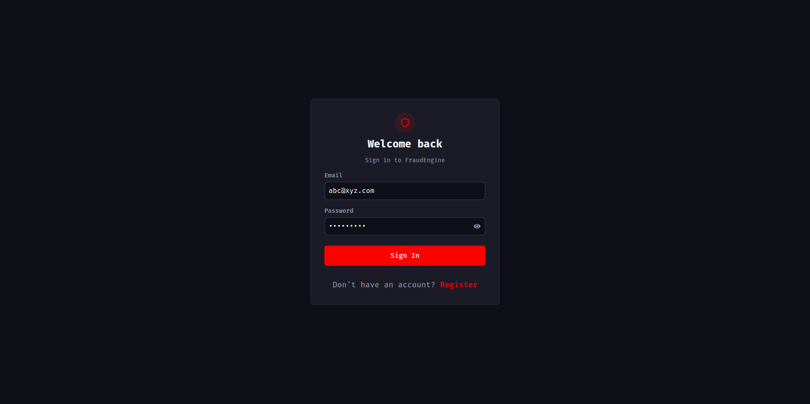
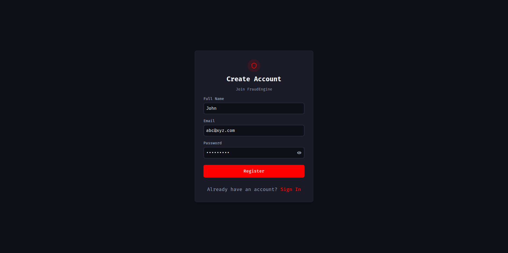
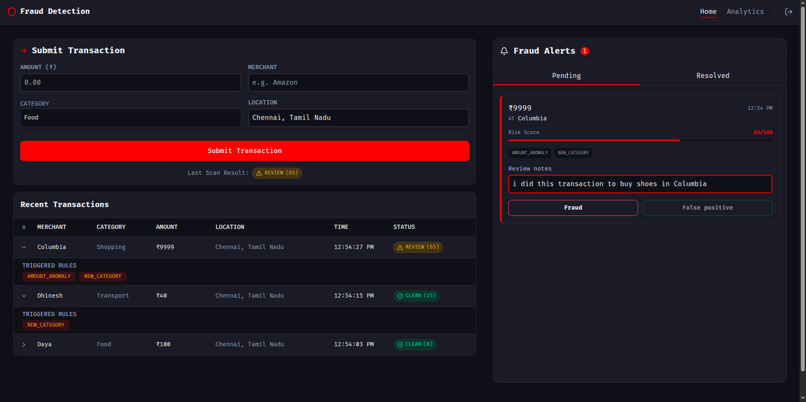
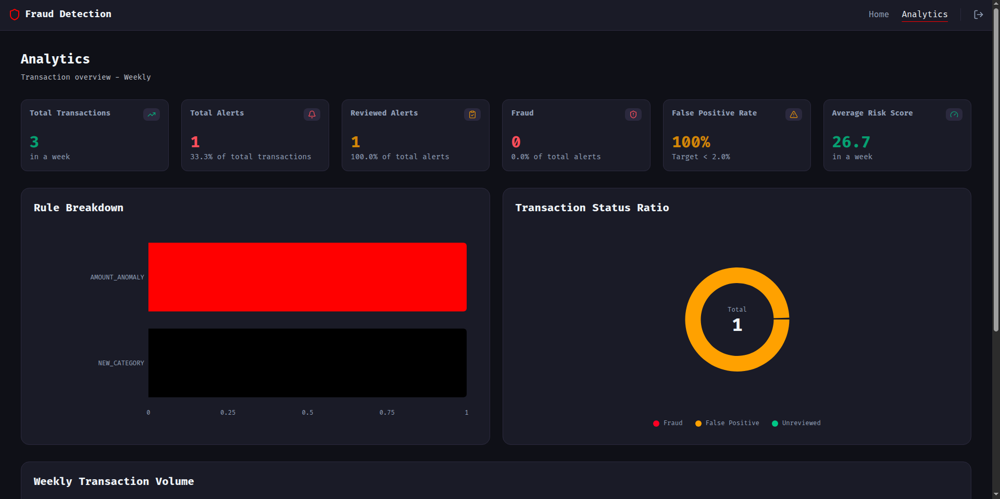
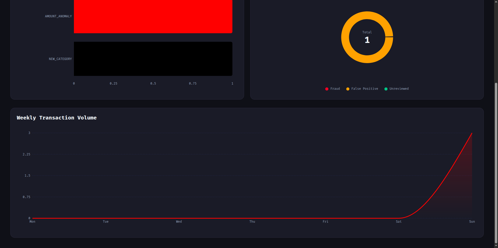

# 🛡️ Fraud Detection Engine

> Real-time transaction fraud detection platform powered by behavioral analytics, anomaly detection, risk scoring, and live alert management.


---

## 🚀 Live Demo

**Frontend:** https://fraud-detection-engine-frontend.vercel.app

**Backend Repository:**
https://github.com/Dhruva-31/fraud-detection-engine-backend

---

## 📖 Overview

Fraud Detection Engine is a full-stack web application that detects potentially fraudulent financial transactions using a rule-based risk scoring system.

The platform continuously evaluates transaction behavior against multiple fraud detection rules and assigns a dynamic risk score. Transactions that exceed predefined thresholds are automatically flagged for review and surfaced through a real-time alert system.

The application demonstrates:

- Real-time fraud detection
- Behavioral transaction analysis
- Risk scoring systems
- Event-driven architecture
- WebSocket communication
- Data visualization and analytics
- Full-stack application design

---

## ✨ Features

### 🔐 Authentication & Security

- User Registration
- Secure Login
- JWT Authentication
- Protected Routes
- Session Persistence

### 💳 Transaction Monitoring

- Submit transactions in real time
- Dynamic fraud scoring
- Triggered rule inspection
- Transaction history
- Status tracking

### 🚨 Fraud Detection Rules

Each transaction is evaluated using multiple fraud detection rules:

| Rule                   | Description                                 |
| ---------------------- | ------------------------------------------- |
| Velocity Breach        | Detects excessive transaction frequency     |
| Amount Anomaly         | Detects unusually large transactions        |
| New Category Detection | Detects spending in unfamiliar categories   |
| Location Anomaly       | Detects transactions from unusual locations |
| Odd Hour Detection     | Detects suspicious transaction timing       |
| Impossible Travel      | Detects unrealistic geographic movement     |

### 📡 Real-Time Alerts

- Instant fraud notifications
- WebSocket-based updates
- Alert review workflow
- Fraud confirmation system
- False positive classification

### 📊 Analytics Dashboard

- Weekly transaction volume
- Alert statistics
- Fraud trends
- Rule breakdown analysis
- Risk score metrics
- Status distribution reports

---

## 📸 Application Screenshots

### 🔐 Authentication

Secure JWT-based authentication with dedicated login and registration flows.

| Login                             | Registration                            |
| --------------------------------- | --------------------------------------- |
|  |  |

---

### 🏠 Transaction Monitoring Dashboard

The main dashboard enables users to submit transactions, review fraud scores, inspect triggered rules, and manage fraud alerts.



#### Highlights

- Transaction submission form
- Fraud score calculation
- Triggered rule visualization
- Recent transaction history
- Alert management workflow
- Fraud / False Positive review system

---

### 📊 Analytics Dashboard

Provides insights into system performance and fraud detection effectiveness.



#### Metrics

- Total Transactions
- Total Alerts
- Reviewed Alerts
- Fraud Count
- False Positive Rate
- Average Risk Score

---

### 📈 Weekly Transaction Trends

Visual representation of transaction activity and alert generation patterns.



Insights include:

- Weekly transaction volume
- Fraud detection trends
- Rule distribution
- Alert classifications

---

## 🧠 Fraud Scoring System

Each fraud rule contributes points toward a transaction's overall risk score.

| Risk Score | Status  |
| ---------- | ------- |
| 0 - 39     | CLEAN   |
| 40 - 79    | REVIEW  |
| 80+        | FLAGGED |

### Example

```text
Velocity Breach      +40
Amount Anomaly       +30
Location Anomaly     +15
-------------------------
Total Risk Score     =85

Status: FLAGGED
```

---

## 🏗️ System Architecture

```text
User
 │
 ▼
React Frontend
 │
 ▼
Express API
 │
 ├── Authentication Service
 │
 ├── Transaction Service
 │
 ├── Analytics Service
 │
 ├── Alert Service
 │
 └── Fraud Detection Engine
        │
        ├── Velocity Check
        ├── Amount Anomaly
        ├── Location Anomaly
        ├── Odd Hour Detection
        ├── New Category Detection
        └── Impossible Travel
                │
                ▼
            Risk Score
                │
                ▼
      CLEAN / REVIEW / FLAGGED
                │
                ▼
         PostgreSQL Database
                │
                ▼
         Socket.IO Alerts
```

---

## ⚙️ Tech Stack

### Frontend

| Technology       | Purpose                  |
| ---------------- | ------------------------ |
| React            | User Interface           |
| React Router     | Routing                  |
| Axios            | API Communication        |
| Recharts         | Analytics Visualizations |
| Socket.IO Client | Real-Time Updates        |
| CSS              | Styling                  |
| Lucide React     | Icons                    |

### Backend

| Technology | Purpose                 |
| ---------- | ----------------------- |
| Node.js    | Runtime Environment     |
| Express.js | REST API                |
| PostgreSQL | Database                |
| Prisma ORM | Database Access         |
| JWT        | Authentication          |
| Socket.IO  | Real-Time Communication |
| Winston    | Logging                 |
| Geolib     | Geolocation Analysis    |

---

## 📂 Frontend Project Structure

```text
src/
│
├── api/
│   └── axios.js
│
├── components/
│   ├── AlertCard.jsx
│   ├── Navbar.jsx
│   ├── Status.jsx
│   ├── SummaryCard.jsx
│   └── TransactionCard.jsx
│
├── context/
│   ├── AuthContext.js
│   └── SocketContext.js
│
├── pages/
│   ├── Home.jsx
│   ├── Analytics.jsx
│   ├── Login.jsx
│   └── Register.jsx
│
├── App.jsx
└── index.js
```

---

## 🔧 Environment Variables

Create a `.env` file in the project root:

```env
REACT_APP_API_URL=http://localhost:5000/api
REACT_APP_SOCKET_URL=http://localhost:5000
```

---

## 🚀 Installation

### Clone Repository

```bash
git clone https://github.com/Dhruva-31/fraud-detection-engine-frontend.git

cd fraud-detection-engine-frontend
```

### Install Dependencies

```bash
npm install
```

### Configure Environment Variables

```bash
cp .env.example .env
```

Update the environment values.

### Run Development Server

```bash
npm start
```

Application will be available at:

```text
http://localhost:3000
```

---

## 🔄 Transaction Flow

```text
User Login
      │
      ▼
Submit Transaction
      │
      ▼
Fraud Detection Engine
      │
      ▼
Rule Evaluation
      │
      ▼
Risk Score Generation
      │
      ▼
CLEAN / REVIEW / FLAGGED
      │
      ▼
Store in Database
      │
      ▼
Generate Alert
      │
      ▼
Real-Time Dashboard Update
```

---

## 📈 Future Improvements

- Machine Learning-Based Fraud Detection
- Adaptive Risk Scoring
- Device Fingerprinting
- Multi-Factor Authentication
- Explainable Fraud Insights
- Kafka Event Streaming
- Docker Deployment
- Kubernetes Support
- Admin Investigation Portal
- Transaction Heatmaps

---

## 🤝 Contributing

Contributions are welcome.

1. Fork the repository
2. Create a feature branch
3. Commit your changes
4. Push to your branch
5. Open a Pull Request

---

## 👨‍💻 Author

**Dhruva**

Built to explore fraud detection systems, behavioral analytics, risk scoring engines, real-time event processing, and scalable full-stack architectures.
